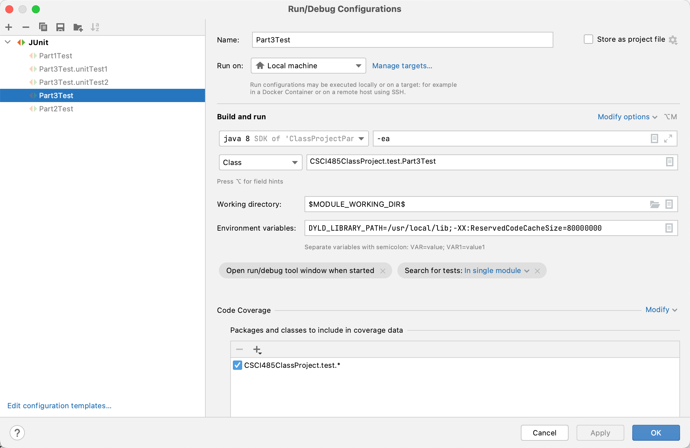
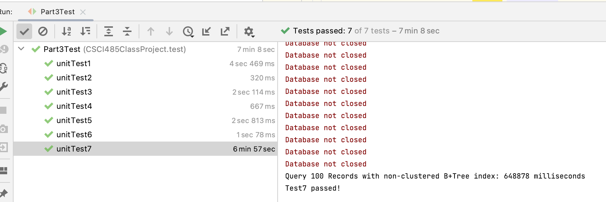

# Class Project: Part 3

submission from Zhihan Wang 2233534677 zhihanwa@usc.edu

# To run the project

Unzip the zip file to a directory

open the directory with IntelliJ

Run project with the following set up



Should get the following result



Query 100 Records without index: 996262 milliseconds

Query 100 Records with non-clustered hash index: 657702 milliseconds

Query 100 Records with non-clustered B+Tree index: 648878 milliseconds

**Note:** numOfRecords is set to 10000 and numOfQueries is set to 100 to expedite the test

/////////////

## Getting Started
You need to copy and paste the code of Part 1 and Part 2 to this project. 
Your codes need to be put under `src/CSCI485ClassProject/` and its subdirectories. 
Once finished, you can verify it by running the unit test of Part1/Part2.

## Project Structure Overview

- `lib`: the dependencies of the project
- `src`: the source codes of the project
  - `CSCI485ClassProject`: root package of the project
    - `models`: package storing some defined representations of models in the database.
    - `test`: package for unit tests
    

## Codes to implement
Under `src/CSCI485ClassProject`, there is 1 class to finish:
- `IndexesImpl`: implementation of an interface class `Indexes`

Also, `RecordsImpl` need to be augmented in order to incorporate indexes.
Feel free to modify other implementations like `Cursor` if needed.

## Run Tests on macOS/Linux using `make`

If you are developing in `macOS/Linux` environment(recommended), we provide `Makefile` for you to run tests quickly.

To run tests of partX, use command
```shell
make partXTest
```

As you may have different project structures, Makefile may not work in your implementation. In this case, you can change the `sources` variable in Makefile by adding the name of the java files you created to it.
Note that the order of the file should align with the class dependency relationship, i.e. class `A` imports `B`, then `B.java` should be in front of `A.java` in `sources`.
